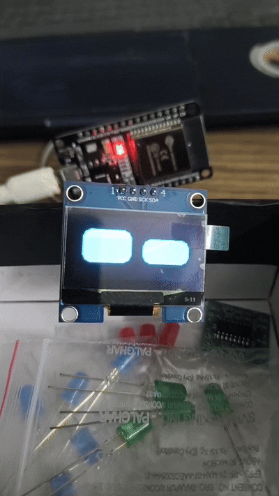
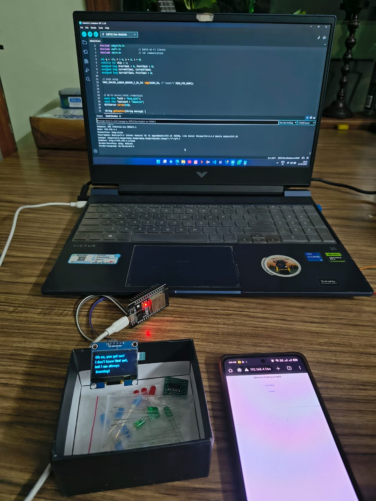
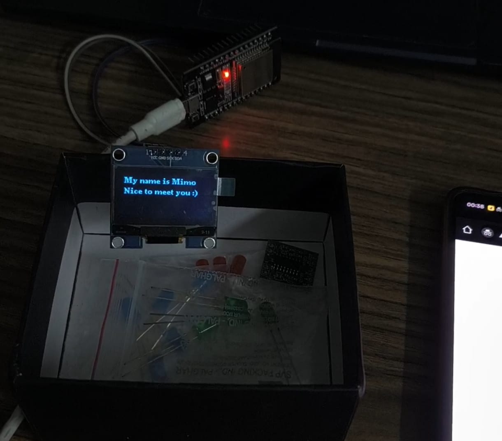

# Talking to Mimo – ESP32 Emotion Display Project

This project lets users interact with an animated character named **Mimo** hosted on an ESP32. When powered on, the ESP32 creates a Wi-Fi Access Point that users can connect to. After joining the network, users can open a webpage and type a message. The message is analyzed and an emotion is displayed on a connected OLED screen in the form of a simple animated face representing that emotion.

---

## 📷 Screenshots





---

## 🔧 Features

- ESP32 acts as a Wi-Fi Access Point.
- Web interface to type messages.
- Messages are processed and translated to emotions.
- OLED displays animated faces based on the emotion.

---

## 📦 Requirements

### Hardware:
- ESP32 (WROOM module recommended)
- 0.96" I2C OLED Display (SSD1306, 128x64)
- Micro USB Cable

### Libraries:
Install these libraries in the Arduino IDE (via Library Manager or ZIP):
- `Adafruit SSD1306`
- `Adafruit GFX`
- `WiFi.h`
- `WebServer.h`
- `Wire.h`

---

## 📡 Network Setup

In your Arduino code, the Wi-Fi name (SSID) and password are set as:

```cpp
const char* ssid = "Mimo-Network";
const char* password = "mimo1234";

After connecting to the wifi network, Wi-Fi Access Point (URL/ IP address) will print on serial monitor of IDE.
Enter that URL address in any browser to access web page for user interaction
